# PAG
*using KaTeX*

- [PAG](#pag)
- [**Analytics**](#analytics)
- [**Communication**](#communication)
	- [Communication table](#communication-table)
	- [One-to-All Broadcast](#one-to-all-broadcast)
		- [**Ring**](#ring)
		- [**2D mesh**](#2d-mesh)
		- [**Hypercube**](#hypercube)
	- [All-to-All Broadcast](#all-to-all-broadcast)
		- [**Ring**](#ring-1)
		- [**2D mesh**](#2d-mesh-1)
		- [**Hypercube**](#hypercube-1)
	- [All-to-All Personalized Broadcast](#all-to-all-personalized-broadcast)
		- [**Ring**](#ring-2)
		- [**2D mesh**](#2d-mesh-2)
		- [**Hypercube** - optimal](#hypercube---optimal)
	- [All-Reduce/Prefix-Sum](#all-reduceprefix-sum)
		- [**Ring**](#ring-3)
		- [**2D mesh**](#2d-mesh-3)
		- [**Hypercube**](#hypercube-2)
	- [Scatter/Gather](#scattergather)
		- [**Ring**](#ring-4)
		- [**2D mesh**](#2d-mesh-4)
		- [**Hypercube**](#hypercube-3)
	- [Circular shift](#circular-shift)
		- [**Ring**](#ring-5)
		- [**2D mesh**](#2d-mesh-5)
		- [**Hypercube**](#hypercube-4)
- [**Matrix-Vector multiplication**](#matrix-vector-multiplication)
	- [Rowwise 1-D Partitioning](#rowwise-1-d-partitioning)
	- [2-D Partitioning](#2-d-partitioning)
- [**Matrix-Matrix multiplication**](#matrix-matrix-multiplication)
	- [2-D Partitioning](#2-d-partitioning-1)
	- [Cannon's Algorithm](#cannons-algorithm)
	- [DNS Algorithm](#dns-algorithm)

# [**Analytics**](#pag)

collapse
 

- Degree of Concurrency - The maximum number of tasks that can be executed in parallel
- Critical Path Length - The length of the longest path in a task dependency graph
- Decomposition
	- Recursive decomposition - divide and conquer strategy
	- Data decomposition (output/input/intermediate)
	- Exploratory decomposition - while exploring state space, each state is an input for a task
	- Speculative decomposition - we speculate what to compute
	- Hybrid Decompositions - mix of decompositions
- Tasks
	- Static/Dynamic generation - we know/don't know the number of tasks on the start
	- Uniform/non-uniform size - same/different size of tasks
	- Static/Dynamic mapping - we map tasks to processors a-priori/at runtime
- $p$ - number of processors
- $m$ - message size
- $t_s$ - time to initialize communication
- $t_w$ - time to send one word
- $t_s+t_wm$ - point-to-point communication
- $T_S$ - serial time
- $T_P$ - parallel time
- $T_{all}=pT_P$ - cost (total time collectively spent on all processors $p$)
- $T_o=pT_P-T_S$ - overhead
- $S=\frac{T_S}{T_P}$ - speedup [0;$\frac{T_S}{p}$] (unless Super-linear speedups)
- $S\le \frac{T_S}{\beta T_S+(1-\beta)T_S/p}=\frac{p}{\beta p+(1-\beta)}$ - Amdahl's Law for max speedup (better upper bound)
  - based that you have some part $\beta$ of $T_S$ that you can not parallelize
- $E=\frac{S}{p}=\frac{T_S}{pT_P}=\frac{1}{1+\frac{T_o}{T_S}}$ - efficiency
- If $O(T_{all})=O(T_S)\equiv E=O(1)$ parallel algorithm is cost-optimal
- $W=O(T_S)$ - asymptotic value of reference (best) serial time
- $T_o(W,p)=O(pT_P-W)$ - asymptotic overhead from reference serial algorithm
- $K=\frac{E}{1-E}$ - constant depending on efficiency
- $W=KT_o(W,p)$ - isoefficiency function (rate at which the problem size must increase with respect to the number of processing elements to keep the efficiency)
- 
- Super-linear speedups - we do less work to find the solution thanks to parallelization => better speedup than possible
- Sub-linear speedups - we do more work to find the solution thanks to parallelization => worse speedup than anticipated
- Geometric progression: $\sum_{i=1}^{n}{q^{i}}=a_1\frac{1-q^n}{1-q}$
- Arithmetical progression: $\sum_{i=1}^{n}{i}=\frac{n(a_1+a_n)}{2}$

*Base for all logarithms is 2, if not specified otherwise.*

# [**Communication**](#pag)

collapse
 

## Communication table

| | Ring | 2D mesh | Hypercube |
|:--|:--:|:--:|:--:|
| **One-to-All** | $(t_s+t_wm)*\log{p}$ | $(t_s+t_wm)*\log{p}$ | $(t_s+t_wm)*\log{p}$ |
| **All-to-All** | $(t_s+t_wm)*(p-1)$ | $2t_s*(\sqrt{p}-1)+t_wm*(p-1)$ | $t_s\log{p}+t_wm*(p-1)$ |
| **All-to-All Personalized** | $(t_s+t_wm\frac{p}{2})*(p-1)$ | $(2t_s+t_wmp)*(\sqrt{p}-1)$ | $(t_s+t_wm)*(p-1)$  |
| **All-Reduce/Prefix-Sum** | $(t_s+t_wm)*(p-1)$ | $2*(t_s+t_wm)*(\sqrt{p}-1)$ | $(t_s+t_wm)*\log{p}$ |
| **Scatter/Gather** | $t_s\log{p}+t_wm*(p-1)$ | $t_s\log{p}+t_wm*(p-1)$ | $t_s\log{p}+t_wm*(p-1)$ |
| **Circular Shift** | $(t_s+t_wm)*\frac{p}{2}$ | $(t_s+t_wm)*(\sqrt{p}+1)$ | $t_s+t_wm$ |

## One-to-All Broadcast 

---

collapse
 

### **Ring**

Uniform message size!

Easy by recursive doubling => $\log{p}$ steps

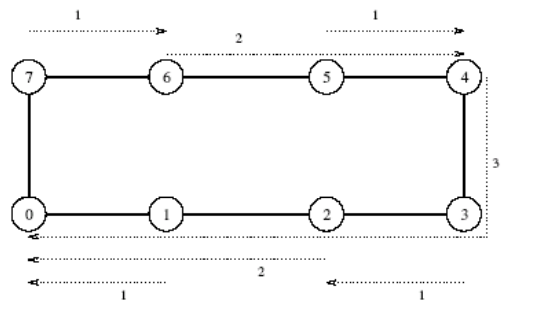

Result: $(t_s+t_wm)*\log{p}$

### **2D mesh**

Uniform message size!

1. recursive doubling in one axis => $\log{\sqrt{p}}$ steps
2. recursive doubling in the other axis => $\log{\sqrt{p}}$ steps

$\log{\sqrt{p}}+\log{\sqrt{p}}=2\log{\sqrt{p}}=\log{\sqrt{p^2}}=\log{p}$

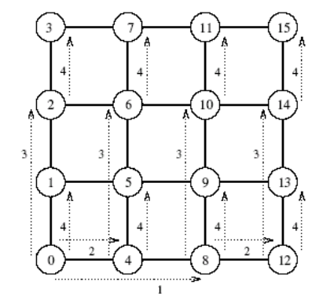

Result: $(t_s+t_wm)*\log{p}$

### **Hypercube**

Uniform message size!

Point-to-point communication in every dimension => $\log{p}$ steps

(hypercube with vertexes identified by Grey code, it is a communication between vertexes changing on $i$'s bit of ID, where $i$ goes from most significant bit to least)

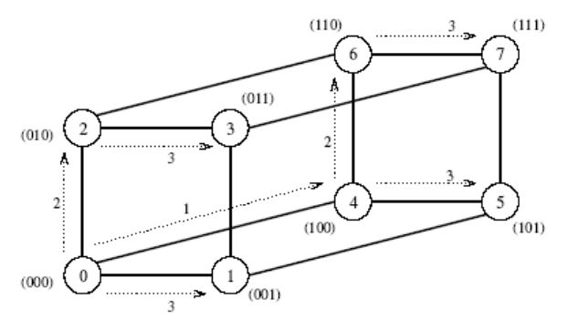

Result: $(t_s+t_wm)*\log{p}$

## All-to-All Broadcast 

---

collapse
 

### **Ring**

Uniform message size!

We send the value we just received to the next node (starting with our own value) => $p-1$ steps

Result $(t_s+t_wm)*(p-1)$

### **2D mesh**

Non-uniform message size! (we have 2 sizes of messages)

1. We send in one axis same as on Ring => $(t_s+t_wm)*(\sqrt{p}-1)$
2. We send in the other axes with the enlarged message => $(t_s+t_wm\sqrt{p})*(\sqrt{p}-1)$

$(t_s+t_wm)*(\sqrt{p}-1)+(t_s+t_wm\sqrt{p})*(\sqrt{p}-1)=2t_s*(\sqrt{p}-1)+(t_wm(\sqrt{p}+1))*(\sqrt{p}-1)=$

$=2t_s*(\sqrt{p}-1)+t_wm(p+\sqrt{p})-t_wm(\sqrt{p}+1)=2t_s*(\sqrt{p}-1)+t_wm*(p-1)$

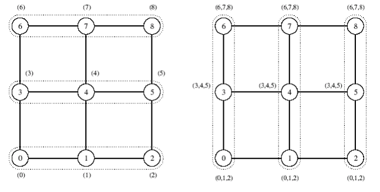

Result: $2t_s*(\sqrt{p}-1)+t_wm*(p-1)$

### **Hypercube**

Non-uniform message size! (in each step the message is doubled)

Each step we exchange data on neighboring nodes in one dimension => $\log{p}$ steps

$\sum_{i=1}^{\log{p}}{(t_s+t_w2^{i-1}m)}=t_s\log{p}+t_wm\sum_{i=1}^{\log{p}}{2^{i-1}}=t_s\log{p}+t_wm*1*\frac{1-2^{\log_2{p}}}{1-2}=$

$=t_s\log{p}+t_wm*\frac{1-p^{\log_2{2}}}{-1}=t_s\log{p}+t_wm*(p-1)$

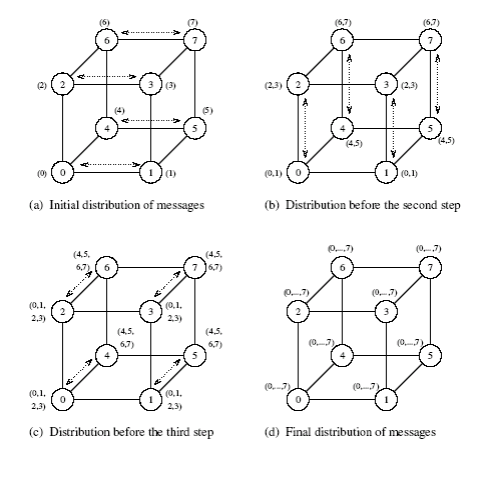

Result: $t_s\log{p}+t_wm*(p-1)$

## All-to-All Personalized Broadcast 

---

collapse
 

### **Ring**

Non-uniform message size! (in each step the message is reduced by $m$)

We send message we just received except the part of the message addressed to us (starting with sending message containing data for all other nodes $(p-1)m$) => $p-1$ steps

$\sum_{i=1}^{p-1}{(t_s+t_w(p-i)m)}=\sum_{i=1}^{p-1}{(t_s+t_wim)}=t_s*(p-1)+t_wm\sum_{i=1}^{p-1}{i}=t_s*(p-1)+t_wm*\frac{(p-1)*(1+(p-1))}{2}=$

$=t_s*(p-1)+t_wm\frac{p}{2}*(p-1)=(t_s+t_wm\frac{p}{2})*(p-1)$

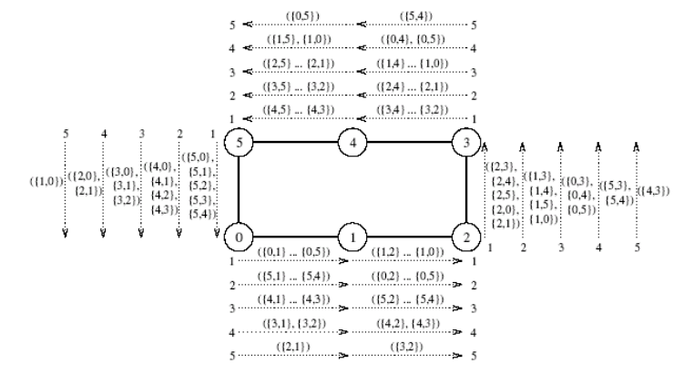

Result: $(t_s+t_wm\frac{p}{2})*(p-1)$

### **2D mesh**

Sort of non-uniform message size... (inside each step the message is reducing, but both start with the same message size)

1. We send in one axis similarly as on Ring, but we also keep the data addressed to the nodes in the same other axis => $(t_s+t_wm\frac{p}{2})*(\sqrt{p}-1)$
2. We send in the other axes but the message size is the same, because in the first step we basically only reorganized the messages in one axis to now send it in the other one => $(t_s+t_wm\frac{p}{2})*(\sqrt{p}-1)$

$(t_s+t_wm\frac{p}{2})*(\sqrt{p}-1)+(t_s+t_wm\frac{p}{2})*(\sqrt{p}-1)=(2t_s+t_wmp)*(\sqrt{p}-1)$

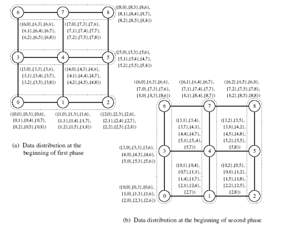

Result: $(2t_s+t_wmp)*(\sqrt{p}-1)$

### **Hypercube** - optimal

Uniform message size! (we know the target so we only send the data addressed to it)

In each step $j$ we send message from $i^{th}$ node to $(i XOR j)^{th}$ node, where $j$ is an increasing number going from $1$ to $p$ => $p-1$ steps with point-to-pont communication

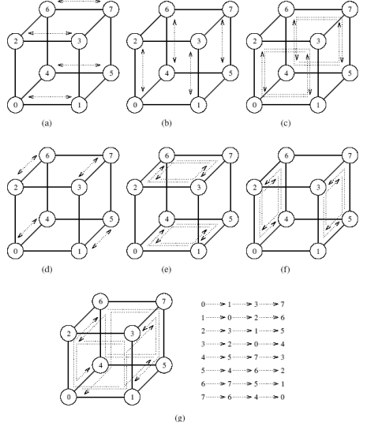

Result: $(t_s+t_wm)*(p-1)$

## All-Reduce/Prefix-Sum 

---

collapse
 

All-Reduce - we want to reduce (use aggregation function like sum,max,min...) values on all processors to one present on all processors => All-to-All with unified message size

Prefix-Sum - an array distributed on processors we want to create a new array containing previous summed with every preceding number from the original array => All-to-All with unified message size

### **Ring**

Uniform message size!

We send the value we just received to the next node (starting with our own value) => $p-1$ steps

Result $(t_s+t_wm)*(p-1)$

### **2D mesh**

Uniform message size!

1. We send in one axis same as on Ring => $(t_s+t_wm)*(\sqrt{p}-1)$
2. We send in the other axes => $(t_s+t_wm)*(\sqrt{p}-1)$

$(t_s+t_wm)*(\sqrt{p}-1)+(t_s+t_wm)*(\sqrt{p}-1)=2*(t_s+t_wm)*(\sqrt{p}-1)$

Result: $2*(t_s+t_wm)*(\sqrt{p}-1)$

### **Hypercube**

Uniform message size!

Each step we exchange data on neighboring nodes in one dimension => $\log{p}$ steps

Result: $(t_s+t_wm)*\log{p}$

## Scatter/Gather 

---

collapse
 

Basically One-to-All broadcast where the message size is changing. 

*Calculations here are base on Gather (it is easier to show in sums as the message increases, but applies to Scatter as well just substitute $2^{i-1}=>2^{(\log{p}-1)-(i-1)}=2^{\log{p}-i}$).*

### **Ring**

Non-uniform message size!

Easy by recursive doubling, where every step doubles the message size => $\log{p}$ steps

$\sum_{i=1}^{\log{p}}{(t_s+t_w2^{i-1}m)}=t_s\log{p}+t_wm\sum_{i=1}^{\log{p}}{2^{i-1}}=t_s\log{p}+t_wm*1*\frac{1-2^{\log_2{p}}}{1-2}=t_s\log{p}+t_wm*\frac{1-p^{\log_2{2}}}{-1}=t_s\log{p}+t_wm*(p-1)$

Result: $t_s\log{p}+t_wm*(p-1)$

### **2D mesh**

Non-uniform message size!

1. recursive doubling in one axis same as on ring => $\log{\sqrt{p}}$ steps
2. recursive doubling in the other axis, but starting with message size equal to half of the message size at the end of step 1. => $\log{\sqrt{p}}$ steps

$\sum_{i=1}^{\log{\sqrt{p}}}{(t_s+t_w2^{i-1}m)}+\sum_{i=\log{\sqrt{p}+1}}^{\log{p}}{(t_s+t_w2^{i-1}m)}=\sum_{i=1}^{\log{p}}{(t_s+t_w2^{i-1}m)}=t_s\log{p}+t_wm*(p-1)$

Result: $t_s\log{p}+t_wm*(p-1)$

### **Hypercube**

Non-uniform message size!

Point-to-point communication in every dimension, where every dimension the message doubled in size => $\log{p}$ steps

(hypercube with vertexes identified by Grey code, it is a communication between vertexes changing on $i$'s bit of ID, where $i$ goes from most significant bit to least)

$\sum_{i=1}^{\log{p}}{(t_s+t_w2^{i-1}m)}=t_s\log{p}+t_wm\sum_{i=1}^{\log{p}}{2^{i-1}}=t_s\log{p}+t_wm*1*\frac{1-2^{\log_2{p}}}{1-2}=t_s\log{p}+t_wm*\frac{1-p^{\log_2{2}}}{-1}=t_s\log{p}+t_wm*(p-1)$

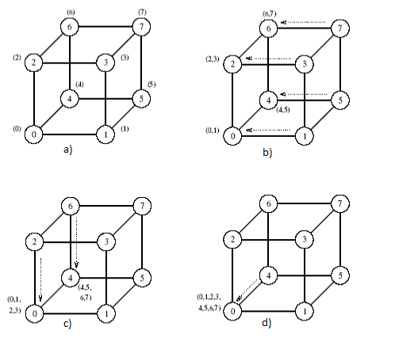

Result: $t_s\log{p}+t_wm*(p-1)$

## Circular shift 

---

collapse
 

Shifting the data on processors so that $i^{th}$ processor sends its data to $(i+q)\bmod{p}$ processor, where $q$ is the shift.

### **Ring**

Uniform message size!

You can't do point-to-point communication as you will overflow the buffers for communication, so you just shift the array in one direction $q$ times => max $\frac{p}{2}$ steps (otherwise you go the other way)

Result: $(t_s+t_wm)*\frac{p}{2}$

### **2D mesh**

Uniform message size!

1. we shift every row for $q\bmod\sqrt{p}$ to align numbers to the right columns => max $\frac{\sqrt{p}}{2}$ steps
2. we need to correct some some columns to still have a sequence, by shifting first $\max(0,(q\bmod\sqrt{p})-1)$ columns by one => one 1-to-1 communication
3. lastly we shift every column for $\lfloor q\div\sqrt{p}\rfloor$ to complete the circular shift => max $\frac{\sqrt{p}}{2}$ steps

$(t_s+t_wm)*\frac{\sqrt{p}}{2}+(t_s+t_wm)+(t_s+t_wm)*\frac{\sqrt{p}}{2}=(t_s+t_wm)+2*(t_s+t_wm)*\frac{\sqrt{p}}{2}=(t_s+t_wm)*(\sqrt{p}+1)$

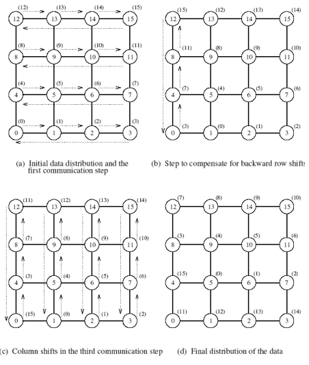

Result: $(t_s+t_wm)*(\sqrt{p}+1)$

### **Hypercube**

Uniform message size!

You just send point-to-point message from $i^{th}$ node to $(i+q)\bmod{p}$ => one 1-to-1 communication
	
Route is created by flipping bits of source id $i$ according to which bits need to be flipped to get target id, going from least significant bit to most significant (e.g. on 8 processors $i=7,q=2$ or in binary $i=111,q=110$ meaning target is $((7+2)\bmod{8})=1$. We go $111\to 101\to 001$ or $7\to 5\to 1$ as can be seen in the figure (b) 2-shift )

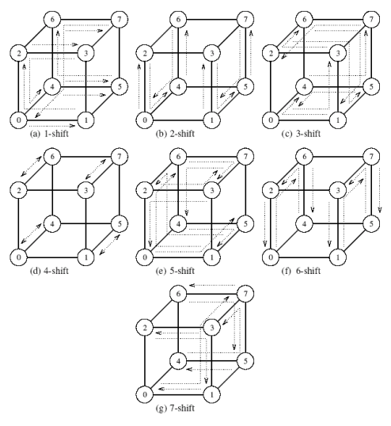

Result: $t_s+t_wm$

# [**Matrix-Vector multiplication**](#pag)

collapse
 

We have $n\times n$ matrix $A$ with vector $x$ of size $n$. (we consider hypercube topology)

Reference serial algorithm $W=O(n^2)$

## Rowwise 1-D Partitioning

---

collapse
 

We have $p\le n$ processors.

We start with the vector $x$ split that every processor have $n/p$.

1. We do all-to-all broadcast on every processor (to distribute the vector) => $t_s\log p+t_w\frac{n}{p}*(p-1)$
2. we calculate => $\frac{n^2}{p}$ operations

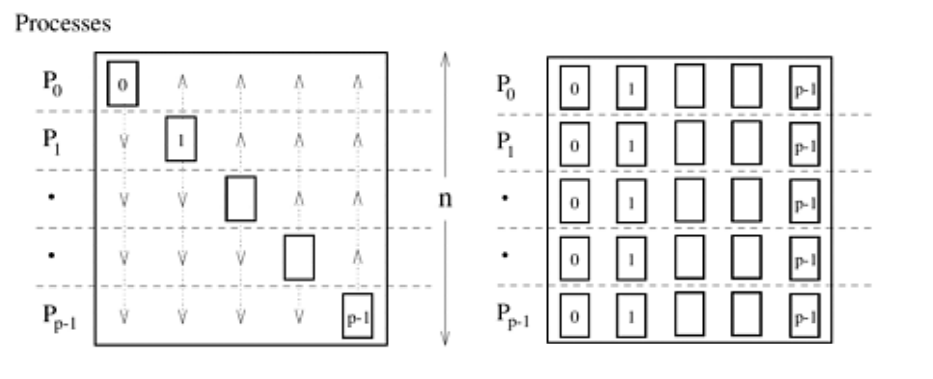

$T_P=\frac{n^2}{p}+(t_s\log p+t_w\frac{n}{p}*(p-1))\approx\frac{n^2}{p}+t_s\log p+t_wn$

$O(T_{all})=O(n^2)=W$ algorithm is cost-optimal

$T_o=p*(\frac{n^2}{p}+t_s\log p+t_wn)-W=n^2+t_sp\log p+t_wnp-n^2=t_sp\log p+t_wnp$

Isoefficiency. As we know $p\le n$ we can say $O(n)=O(p)$

$W=O(p\log p+p*p)=O(p^2)$

Max num. of processors (cost-optimally)

$p=O(n)$

## 2-D Partitioning

---

collapse
 

We have $p\le n^2$ processors.

We start with the vector $x$ split that every processor in the last column having $n/\sqrt p$.

1. We move data to the right column => $t_s+t_w\frac{n}{\sqrt p}$
2. We do one-to-all broadcast to spread the data in columns => $(t_s+t_w\frac{n}{\sqrt p})*\log(\sqrt p)$
3. we calculate => $\frac{n^2}{p}$ operations
4. We do all-to-one reduction to get the result on the last column => $(t_s+t_w\frac{n}{\sqrt p})*\log(\sqrt p)$

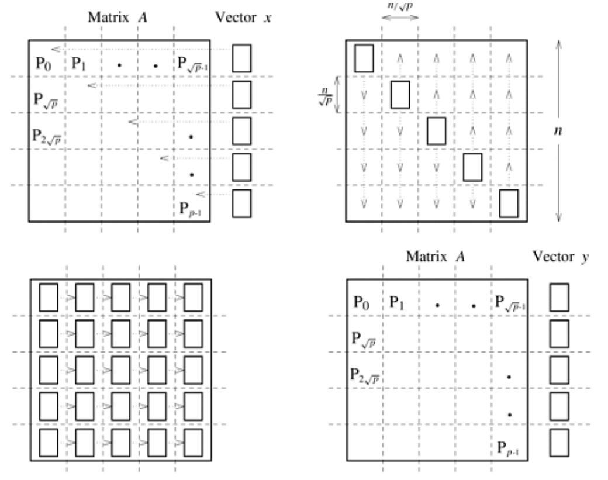

$T_P=\frac{n^2}{p}+2*(t_s+t_w\frac{n}{\sqrt p})*\log\sqrt p+(t_s+t_w\frac{n}{\sqrt p})=\frac{n^2}{p}+(t_s+t_w\frac{n}{\sqrt p})*\log p\approx \frac{n^2}{p}+t_s\log p+t_w\frac{n}{\sqrt p}\log p$

$O(T_{all})=O(n^2)=W$ algorithm is cost-optimal

$T_o=p*(\frac{n^2}{p}+t_s\log p+t_w\frac{n}{\sqrt p}\log p)-W=n^2+t_sp\log p+t_wp\frac{n}{\sqrt p}\log p-n^2=t_sp\log p+t_wn\sqrt p\log p$

Isoefficiency

$W=O(n^2)=O(n\sqrt p\log p)~~~/\div n$

$O(n)=O(\sqrt p\log p)~~~/^2$

$W=O(p\log^2 p)$

Max num. of processors (cost-optimally)

We can substitute: 

$O(\log n^2)=O(\log(p\log^2 p))$

$O(\log n)=O(\log p+\log\log p)$ where $\log\log p <\log p$

$O(\log n)=O(\log p)$

$O(n^2)=O(p\log^2 p)$

$O(n^2)=O(p\log^2 n)$

$O(\frac{n^2}{\log^2 n})=O(p)$

$p=O(\frac{n^2}{\log^2 n})$

# [**Matrix-Matrix multiplication**](#pag)

collapse
 

We have two dense $n\times n$ matrixes $A$ and $B$. (we consider hypercube topology)

Reference serial algorithm $W=O(n^3)$

## 2-D Partitioning

---

collapse
 

We have $p\le n^2$ processors.

We consider each processor to have $\frac{n}{\sqrt p}\times\frac{n}{\sqrt p}$ of each matrix called block $A_{i,j}$ or $B_{i,j}$, where $i$ is row index and $j$ is column index (in ranges [0;n)). 

*This algorithm is not memory optimal as you multiply the data $\sqrt p-1$ times.*

1. We do all-to-all broadcast in every row to spread matrix $A$ where needed => $t_s\log{\sqrt p}+t_w\frac{n^2}{p}*(\sqrt{p}-1)$
2. We do all-to-all broadcast in every column to spread matrix $B$ => $t_s\log{\sqrt p}+t_w\frac{n^2}{p}*(\sqrt{p}-1)$
3. We calculate (for one result we do $n$ operations, that needs to be done $\frac{n^2}{p}$ times to calculate all results on processor) => $n*\frac{n^2}{p}$ operations

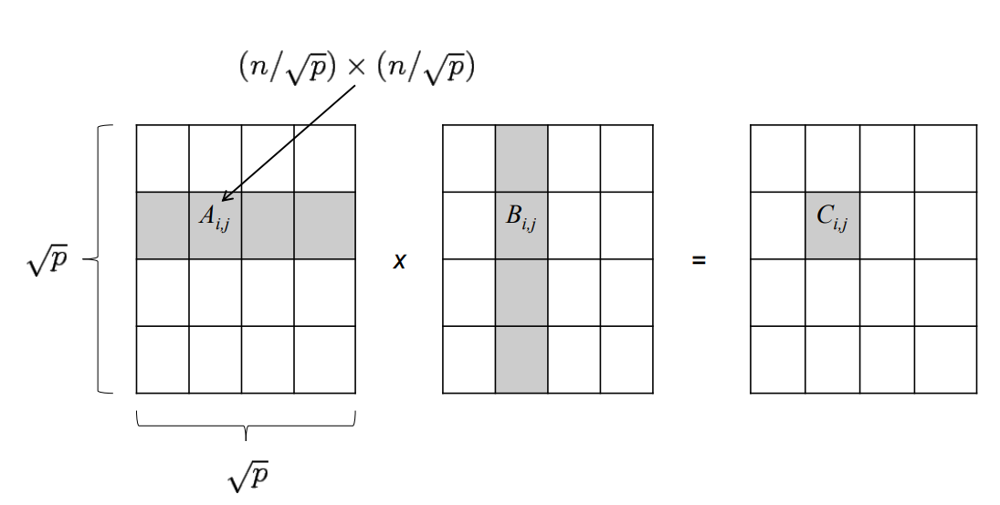

$T_P=n*\frac{n^2}{p}+2*(t_s\log{\sqrt p}+t_w\frac{n^2}{p}*(\sqrt{p}-1))=\frac{n^3}{p}+t_s\log{\sqrt p^2}+2*t_w\frac{n^2}{p}*(\sqrt{p}-1)\approx \frac{n^3}{p}+t_s\log{p}+2*t_w\frac{n^2}{\sqrt p}$

$O(T_{all})=O(n^3)=W$ algorithm is cost-optimal

$T_o=p*(\frac{n^3}{p}+t_s\log{p}+2*t_w\frac{n^2}{\sqrt p})-W=n^3+t_sp\log{p}+2*t_w\sqrt pn^2-n^3=t_sp\log{p}+2*t_w\sqrt pn^2$

Isoefficiency ($t_w$ is asymptotically bigger, because $$p\le n^2$$)

$W=O(n^3)=O(\sqrt pn^2)~~~/\div n^2$

$O(n)=O(\sqrt p)~~~/^3$

$W=O(\sqrt p^3)=O(p^\frac{3}{2})$

Max num. of processors (cost-optimally)

$O(n^3)=O(p^\frac{3}{2})~~~/^\frac{2}{3}$

$O(p)=O(n^2)$

## Cannon's Algorithm

---

collapse
 

We have $p\le n^2$ processors.

We consider each processor to have $\frac{n}{\sqrt p}\times\frac{n}{\sqrt p}$ of each matrix (same as with 2-D Partitioning) called block $A_{i,j}$ or $B_{i,j}$, where $i$ is row index and $j$ is column index (both in ranges [0;n)). But in this algorithm we don't broadcast data but we reorganize after every computation. 

*This algorithm is memory optimal.*

1. We do circular-shift on each block row to the left by $i$ (row index) of $A$ and each column up by $j$ (column index) of $B$ to align them => $2*(t_s+t_w\frac{n^2}{p})$
2. Local multiplications of blocks => $\frac{n}{\sqrt{p}}*\frac{n^2}{p}$
3. We do circular-shift by one to the left on all rows of $A$ and by one up on the columns of $B$ => $2*(t_s+t_w\frac{n^2}{p})$
4. Local multiplications of blocks and add it to partial result => $\frac{n}{\sqrt{p}}*\frac{n^2}{p}$
5. We repeat steps 3. and 4. $\sqrt{p}-1$ times

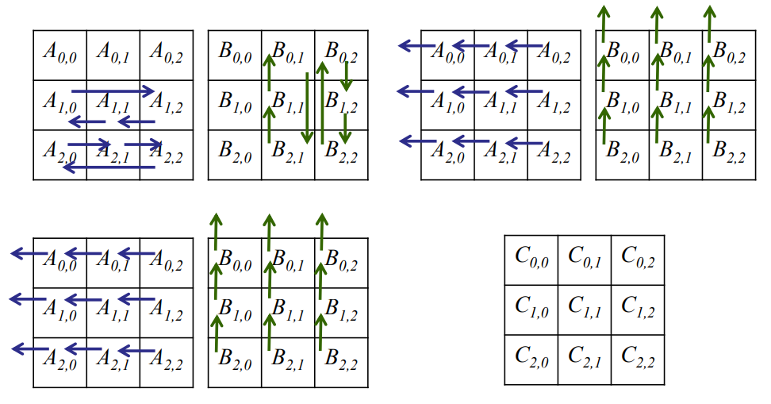

$T_P=2*(t_s+t_w\frac{n^2}{p})+\frac{n}{\sqrt{p}}*\frac{n^2}{p}+(\sqrt{p}-1)*(2*(t_s+t_w\frac{n^2}{p})+\frac{n}{\sqrt{p}}*\frac{n^2}{p})=\sqrt{p}*(2*(t_s+t_w\frac{n^2}{p})+\frac{n}{\sqrt{p}}*\frac{n^2}{p})=2*(t_s\sqrt{p}+t_w\frac{n^2}{p}\sqrt{p})+n*\frac{n^2}{p}=\frac{n^3}{p}+2t_s\sqrt{p}+2t_w\frac{n^2}{\sqrt{p}}$

$O(T_{all})=O(n^3)=W$ algorithm is cost-optimal

$T_o=p*(\frac{n^3}{p}+2t_s\sqrt{p}+2t_w\frac{n^2}{\sqrt{p}})-W=n^3+2t_sp\sqrt{p}+2t_wp\frac{n^2}{\sqrt{p}}-n^3=2t_sp^\frac{3}{2}+2t_w\sqrt{p}n^2$

Isoefficiency ($t_w$ expression is asymptotically bigger, because $$p\le n^2$$) ($t_w$ expression is same as in 2-D Partitioning)

$W=O(n^3)=O(\sqrt pn^2)~~~/\div n^2$

$O(n)=O(\sqrt p)~~~/^3$

$W=O(\sqrt p^3)=O(p^\frac{3}{2})$

Max num. of processors (cost-optimally)

$O(n^3)=O(p^\frac{3}{2})~~~/^\frac{2}{3}$

$O(p)=O(n^2)$

## DNS Algorithm

---

collapse
 

We have $p\le n^3$ processors. Imagine $n\times n\times n$ indexed as $[i,j,k]$ (I am going to call last index $k$ layer).

We consider each processor in $k=0$ to have $\frac{n}{\sqrt[3] p}\times\frac{n}{\sqrt[3] p}$ of each matrix called block $A_{i,j}$ or $B_{i,j}$, where $i$ is row index and $j$ is column index (both in ranges [0;n)).

1. We move blocks of matrix $A_{i,j}$ to processor $[i=i,j=j,k=j]$ and blocks of matrix $B_{i,j}$ to processor $[i=i,j=j,k=i]$ => point-to-point $2*(t_s+t_w\frac{n^2}{p^\frac{2}{3}})$
2. We spread data on each layer $k$ (in $j$ axis for matrix $A$ nad in $i$ axis for $B$) => one-to-all $2*(t_s+t_w\frac{n^2}{p^\frac{2}{3}})*\log{\sqrt[3] p}$
3. We multiply each block $A$ with $B$ on processor => $\frac{n}{\sqrt[3] p}*\frac{n^2}{p^\frac{2}{3}}$
4. We reduce back to layer $k=0$ => $t_s\log{\sqrt[3] p}+t_w\frac{n^2}{p^\frac{2}{3}}\log{\sqrt[3] p}$

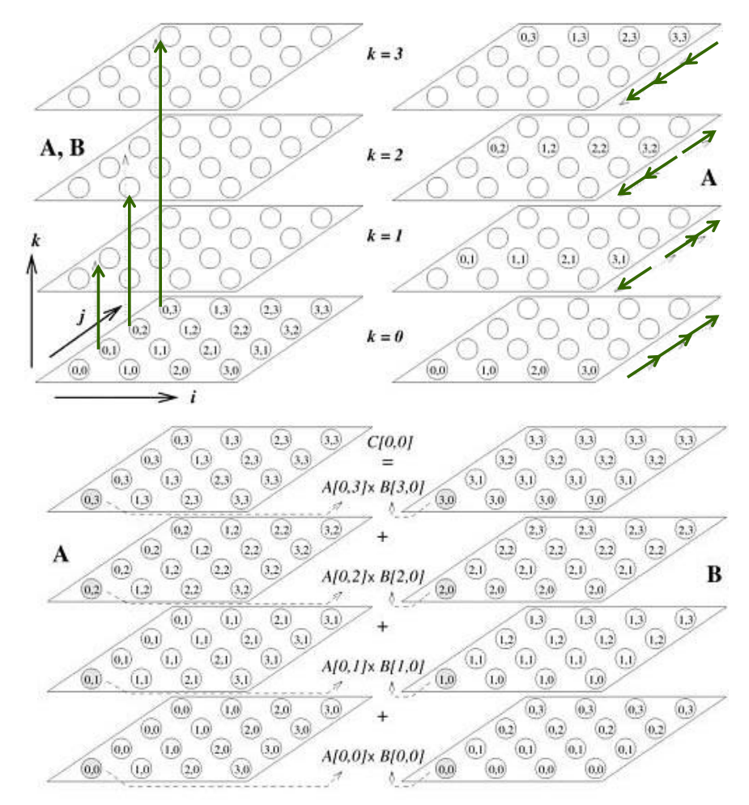

$T_P=2*(t_s+t_w\frac{n^2}{p^\frac{2}{3}})+2*(t_s+t_w\frac{n^2}{p^\frac{2}{3}})*\log{\sqrt[3] p}+\frac{n}{\sqrt[3] p}*\frac{n^2}{p^\frac{2}{3}}+t_s\log{\sqrt[3] p}+t_w\frac{n^2}{p^\frac{2}{3}}\log{\sqrt[3] p}=\frac{n^3}{p}+2t_s\log{\sqrt[3] p}+2t_w\frac{n^2}{p^\frac{2}{3}}\log{\sqrt[3] p}+t_s\log{\sqrt[3] p}+t_w\frac{n^2}{p^\frac{2}{3}}\log{\sqrt[3] p}+2*(t_s+t_w\frac{n^2}{p^\frac{2}{3}})=\frac{n^3}{p}+3t_s\log{\sqrt[3] p}+3t_w\frac{n^2}{p^\frac{2}{3}}\log{\sqrt[3] p}+2*(t_s+t_w\frac{n^2}{p^\frac{2}{3}})=\frac{n^3}{p}+t_s\log{p}+t_w\frac{n^2}{p^\frac{2}{3}}\log{p}+2*(t_s+t_w\frac{n^2}{p^\frac{2}{3}})=\frac{n^3}{p}+t_s*(\log{p}+2)+t_w\frac{n^2}{p^\frac{2}{3}}*(\log{p}+2)\approx\frac{n^3}{p}+t_s\log{p}+t_w\frac{n^2}{p^\frac{2}{3}}\log{p}$

$O(T_{all})=O(n^3)=W$ algorithm is cost-optimal

$T_o=p*(\frac{n^3}{p}+t_s\log{p}+t_w\frac{n^2}{p^\frac{2}{3}}\log{p})-W=n^3+t_sp\log{p}+t_wp\frac{n^2}{p^\frac{2}{3}}\log{p}-n^3=t_sp\log{p}+t_w\sqrt[3]pn^2\log{p}$

Isoefficiency ($t_w$ expression is asymptotically bigger, because $$p\le n^3$$)

$W=O(n^3)=O(\sqrt[3]pn^2\log{p})~~~/\div n^2$

$O(n)=O(\sqrt[3]p\log{p})~~~/^3$

$W=O(p\log^3{p})$

Max num. of processors (cost-optimally)

We can substitute: 

$O(\log n^3)=O(\log(p\log^3 p))$

$O(\log n)=O(\log p+\log\log p)$ where $\log\log p <\log p$

$O(\log n)=O(\log p)$

$O(n^3)=O(p\log^3{p})~~~/^\frac{2}{3}$

$O(n^3)=O(p\log^3{n})~~~/\div\log^3{p}$

$O(\frac{n^3}{\log^3{n}})=O(p)$

$O(p)=O(\frac{n^3}{\log^3{n}})$

