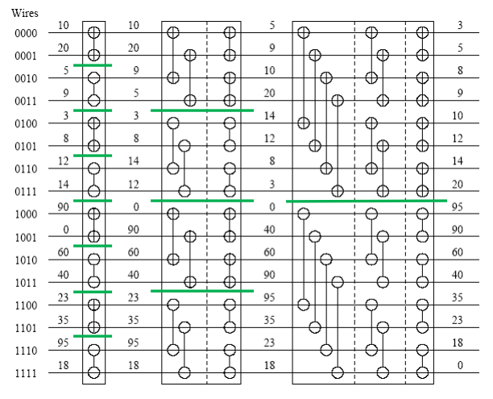

# PAG

*using KaTeX (use your own MD editor/viewer like VS Code as GitHub finds \* in KaTeX and does italic)*

- [PAG](#pag)
- [**Analytics**](#analytics)
- [**Communication**](#communication)
	- [Communication table](#communication-table)
	- [One-to-All Broadcast](#one-to-all-broadcast)
		- [**Ring**](#ring)
		- [**2D mesh**](#2d-mesh)
		- [**Hypercube**](#hypercube)
	- [All-to-All Broadcast](#all-to-all-broadcast)
		- [**Ring**](#ring-1)
		- [**2D mesh**](#2d-mesh-1)
		- [**Hypercube**](#hypercube-1)
	- [All-to-All Personalized Broadcast](#all-to-all-personalized-broadcast)
		- [**Ring**](#ring-2)
		- [**2D mesh**](#2d-mesh-2)
		- [**Hypercube** - optimal](#hypercube---optimal)
	- [All-Reduce/Prefix-Sum](#all-reduceprefix-sum)
		- [**Ring**](#ring-3)
		- [**2D mesh**](#2d-mesh-3)
		- [**Hypercube**](#hypercube-2)
	- [Scatter/Gather](#scattergather)
		- [**Ring**](#ring-4)
		- [**2D mesh**](#2d-mesh-4)
		- [**Hypercube**](#hypercube-3)
	- [Circular shift](#circular-shift)
		- [**Ring**](#ring-5)
		- [**2D mesh**](#2d-mesh-5)
		- [**Hypercube**](#hypercube-4)
- [**Matrix-Vector multiplication**](#matrix-vector-multiplication)
	- [Rowwise 1-D Partitioning](#rowwise-1-d-partitioning)
	- [2-D Partitioning](#2-d-partitioning)
- [**Matrix-Matrix multiplication**](#matrix-matrix-multiplication)
	- [2-D Partitioning](#2-d-partitioning-1)
	- [Cannon's Algorithm](#cannons-algorithm)
	- [DNS Algorithm](#dns-algorithm)
- [**System of Linear Equations**](#system-of-linear-equations)
	- [Gaussian Elimination](#gaussian-elimination)
- [**Sorting Algorithms**](#sorting-algorithms)
	- [Bitonic Sort](#bitonic-sort)
	- [Bitonic Sort (block partition)](#bitonic-sort-block-partition)
	- [Odd-Even Transposition](#odd-even-transposition)
	- [Shellsort](#shellsort)
	- [Quicksort](#quicksort)
	- [Enumeration Sort](#enumeration-sort)
- [**Search Algorithms for Discrete Optimization Problems**](#search-algorithms-for-discrete-optimization-problems)
- [**Graph Algorithms**](#graph-algorithms)
	- [Minimum Spanning Tree: Prim's algorithm](#minimum-spanning-tree-prims-algorithm)
	- [Single-Source Shortest Paths: Parallel Dijkstra's Algorithm](#single-source-shortest-paths-parallel-dijkstras-algorithm)
	- [All-Pairs Shortest Paths](#all-pairs-shortest-paths)
		- [**Matrix-Multiplication Based Algorithm**](#matrix-multiplication-based-algorithm)
		- [**Dijkstra's Algorithm: Source Partitioned**](#dijkstras-algorithm-source-partitioned)
		- [**Dijkstra's Algorithm: Source Parallel**](#dijkstras-algorithm-source-parallel)
		- [**Floyd's Algorithm: 2-D partitioning**](#floyds-algorithm-2-d-partitioning)
		- [**Floyd's Algorithm: 2-D partitioning pipelined**](#floyds-algorithm-2-d-partitioning-pipelined)
	- [Connected Components](#connected-components)
	- [Maximal independent set (MIS)](#maximal-independent-set-mis)
- [**Dynamic Programming**](#dynamic-programming)
- [**Fast Fourier Transform (FFT)**](#fast-fourier-transform-fft)
	- [Cooley-Tukey algorithm](#cooley-tukey-algorithm)
	- [Transpose Algorithm](#transpose-algorithm)

# [**Analytics**](#pag)

collapse
 

- Degree of Concurrency - The maximum number of tasks that can be executed in parallel
- Critical Path Length - The length of the longest path in a task dependency graph
- Decomposition
	- Recursive decomposition - divide and conquer strategy
	- Data decomposition (output/input/intermediate)
	- Exploratory decomposition - while exploring state space, each state is an input for a task
	- Speculative decomposition - we speculate what to compute
	- Hybrid Decompositions - mix of decompositions
- Tasks
	- Static/Dynamic generation - we know/don't know the number of tasks on the start
	- Uniform/non-uniform size - same/different size of tasks
	- Static/Dynamic mapping - we map tasks to processors a-priori/at runtime
- $p$ - number of processors
- $m$ - message size
- $t_s$ - time to initialize communication
- $t_w$ - time to send one word
- $t_s+t_wm$ - point-to-point communication
- $T_S$ - serial time
- $T_P$ - parallel time
- $T_{all}=pT_P$ - cost (total time collectively spent on all processors $p$)
- $T_o=pT_P-T_S$ - overhead
- $S=\frac{T_S}{T_P}$ - speedup [0;$\frac{T_S}{p}$] (unless Super-linear speedups)
- $S\le \frac{T_S}{\beta T_S+(1-\beta)T_S/p}=\frac{p}{\beta p+(1-\beta)}$ - Amdahl's Law for max speedup (better upper bound)
  - based that you have some part $\beta$ of $T_S$ that you can not parallelize
- $E=\frac{S}{p}=\frac{T_S}{pT_P}=\frac{1}{1+\frac{T_o}{T_S}}$ - efficiency
- If $O(T_{all})=O(T_S)\equiv E=O(1)$ parallel algorithm is cost-optimal
- $W=O(T_S)$ - asymptotic value of reference (best) serial time
- $T_o(W,p)=O(pT_P-W)$ - asymptotic overhead from reference serial algorithm
- $K=\frac{E}{1-E}$ - constant depending on efficiency
- $W=KT_o(W,p)$ - isoefficiency function (rate at which the problem size must increase with respect to the number of processing elements to keep the efficiency)
- Super-linear speedups - we do less work to find the solution thanks to parallelization => better speedup than possible
- Sub-linear speedups - we do more work to find the solution thanks to parallelization => worse speedup than anticipated
- Geometric progression: $\sum_{i=1}^{n}{q^{i}}=a_1\frac{1-q^n}{1-q}$
- Arithmetical progression: $\sum_{i=1}^{n}{i}=\frac{n(a_1+a_n)}{2}$

*Base for all logarithms is 2, if not specified otherwise.*

*I forget to write $K$ in every isoefficiency function calculation, but you can add it by yourself.*

# [**Communication**](#pag)

collapse
 

## Communication table

| | Ring | 2D mesh | Hypercube |
|:--|:--:|:--:|:--:|
| **One-to-All** | $(t_s+t_wm)*\log{p}$ | $(t_s+t_wm)*\log{p}$ | $(t_s+t_wm)*\log{p}$ |
| **All-to-All** | $(t_s+t_wm)*(p-1)$ | $2t_s*(\sqrt{p}-1)+t_wm*(p-1)$ | $t_s\log{p}+t_wm*(p-1)$ |
| **All-to-All Personalized** | $(t_s+t_wm\frac{p}{2})*(p-1)$ | $(2t_s+t_wmp)*(\sqrt{p}-1)$ | $(t_s+t_wm)*(p-1)$  |
| **All-Reduce/Prefix-Sum** | $(t_s+t_wm)*(p-1)$ | $2*(t_s+t_wm)*(\sqrt{p}-1)$ | $(t_s+t_wm)*\log{p}$ |
| **Scatter/Gather** | $t_s\log{p}+t_wm*(p-1)$ | $t_s\log{p}+t_wm*(p-1)$ | $t_s\log{p}+t_wm*(p-1)$ |
| **Circular Shift** | $(t_s+t_wm)*\frac{p}{2}$ | $(t_s+t_wm)*(\sqrt{p}+1)$ | $t_s+t_wm$ |

## One-to-All Broadcast 

---

collapse
 

### **Ring**

Uniform message size!

Easy by recursive doubling => $\log{p}$ steps

Result: $(t_s+t_wm)*\log{p}$

### **2D mesh**

Uniform message size!

1. recursive doubling in one axis => $\log{\sqrt{p}}$ steps
2. recursive doubling in the other axis => $\log{\sqrt{p}}$ steps

$\log{\sqrt{p}}+\log{\sqrt{p}}=2\log{\sqrt{p}}=\log{\sqrt{p^2}}=\log{p}$

Result: $(t_s+t_wm)*\log{p}$

### **Hypercube**

Uniform message size!

Point-to-point communication in every dimension => $\log{p}$ steps

(hypercube with vertexes identified by Grey code, it is a communication between vertexes changing on $i$'s bit of ID, where $i$ goes from most significant bit to least)

Result: $(t_s+t_wm)*\log{p}$

## All-to-All Broadcast 

---

collapse
 

### **Ring**

Uniform message size!

We send the value we just received to the next node (starting with our own value) => $p-1$ steps

Result $(t_s+t_wm)*(p-1)$

### **2D mesh**

Non-uniform message size! (we have 2 sizes of messages)

1. We send in one axis same as on Ring => $(t_s+t_wm)*(\sqrt{p}-1)$
2. We send in the other axes with the enlarged message => $(t_s+t_wm\sqrt{p})*(\sqrt{p}-1)$

$(t_s+t_wm)*(\sqrt{p}-1)+(t_s+t_wm*\sqrt{p})*(\sqrt{p}-1)=2t_s*(\sqrt{p}-1)+(t_wm*(\sqrt{p}+1))*(\sqrt{p}-1)=$

$=2t_s*(\sqrt{p}-1)+t_wm(p+\sqrt{p})-t_wm(\sqrt{p}+1)=2t_s*(\sqrt{p}-1)+t_wm*(p-1)$

Result: $2t_s*(\sqrt{p}-1)+t_wm*(p-1)$

### **Hypercube**

Non-uniform message size! (in each step the message is doubled)

Each step we exchange data on neighboring nodes in one dimension => $\log{p}$ steps

$\sum_{i=1}^{\log{p}}{(t_s+t_w2^{i-1}m)}=t_s\log{p}+t_wm\sum_{i=1}^{\log{p}}{2^{i-1}}=t_s\log{p}+t_wm*1*\frac{1-2^{\log_2{p}}}{1-2}=$

$=t_s\log{p}+t_wm*\frac{1-p^{\log_2{2}}}{-1}=t_s\log{p}+t_wm*(p-1)$

Result: $t_s\log{p}+t_wm*(p-1)$

## All-to-All Personalized Broadcast 

---

collapse
 

### **Ring**

Non-uniform message size! (in each step the message is reduced by $m$)

We send message we just received except the part of the message addressed to us (starting with sending message containing data for all other nodes $(p-1)m$) => $p-1$ steps

$\sum_{i=1}^{p-1}{(t_s+t_w(p-i)m)}=\sum_{i=1}^{p-1}{(t_s+t_wim)}=t_s*(p-1)+t_wm\sum_{i=1}^{p-1}{i}=t_s*(p-1)+t_wm*\frac{(p-1)*(1+(p-1))}{2}=$

$=t_s*(p-1)+t_wm\frac{p}{2}*(p-1)=(t_s+t_wm\frac{p}{2})*(p-1)$

Result: $(t_s+t_wm\frac{p}{2})*(p-1)$

### **2D mesh**

Sort of non-uniform message size... (inside each step the message is reducing, but both start with the same message size)

1. We send in one axis similarly as on Ring, but we also keep the data addressed to the nodes in the same other axis => $(t_s+t_wm\frac{p}{2})*(\sqrt{p}-1)$
2. We send in the other axes but the message size is the same, because in the first step we basically only reorganized the messages in one axis to now send it in the other one => $(t_s+t_wm\frac{p}{2})*(\sqrt{p}-1)$

$(t_s+t_wm\frac{p}{2})*(\sqrt{p}-1)+(t_s+t_wm\frac{p}{2})*(\sqrt{p}-1)=(2t_s+t_wmp)*(\sqrt{p}-1)$

Result: $(2t_s+t_wmp)*(\sqrt{p}-1)$

### **Hypercube** - optimal

Uniform message size! (we know the target so we only send the data addressed to it)

In each step $j$ we send message from $i^{th}$ node to $(i XOR j)^{th}$ node, where $j$ is an increasing number going from $1$ to $p$ => $p-1$ steps with point-to-pont communication

Result: $(t_s+t_wm)*(p-1)$

## All-Reduce/Prefix-Sum 

---

collapse
 

All-Reduce - we want to reduce (use aggregation function like sum,max,min...) values on all processors to one present on all processors => All-to-All with unified message size

Prefix-Sum - an array distributed on processors we want to create a new array containing previous summed with every preceding number from the original array => All-to-All with unified message size

### **Ring**

Uniform message size!

We send the value we just received to the next node (starting with our own value) => $p-1$ steps

Result $(t_s+t_wm)*(p-1)$

### **2D mesh**

Uniform message size!

1. We send in one axis same as on Ring => $(t_s+t_wm)*(\sqrt{p}-1)$
2. We send in the other axes => $(t_s+t_wm)*(\sqrt{p}-1)$

$(t_s+t_wm)*(\sqrt{p}-1)+(t_s+t_wm)*(\sqrt{p}-1)=2*(t_s+t_wm)*(\sqrt{p}-1)$

Result: $2*(t_s+t_wm)*(\sqrt{p}-1)$

### **Hypercube**

Uniform message size!

Each step we exchange data on neighboring nodes in one dimension => $\log{p}$ steps

Result: $(t_s+t_wm)*\log{p}$

## Scatter/Gather 

---

collapse
 

Basically One-to-All broadcast where the message size is changing. 

*Calculations here are base on Gather (it is easier to show in sums as the message increases, but applies to Scatter as well just substitute $2^{i-1}=>2^{(\log{p}-1)-(i-1)}=2^{\log{p}-i}$).*

### **Ring**

Non-uniform message size!

Easy by recursive doubling, where every step doubles the message size => $\log{p}$ steps

$\sum_{i=1}^{\log{p}}{(t_s+t_w2^{i-1}m)}=t_s\log{p}+t_wm\sum_{i=1}^{\log{p}}{2^{i-1}}=t_s\log{p}+t_wm*1*\frac{1-2^{\log_2{p}}}{1-2}=t_s\log{p}+t_wm*\frac{1-p^{\log_2{2}}}{-1}=t_s\log{p}+t_wm*(p-1)$

Result: $t_s\log{p}+t_wm*(p-1)$

### **2D mesh**

Non-uniform message size!

1. recursive doubling in one axis same as on ring => $\log{\sqrt{p}}$ steps
2. recursive doubling in the other axis, but starting with message size equal to half of the message size at the end of step 1. => $\log{\sqrt{p}}$ steps

$\sum_{i=1}^{\log{\sqrt{p}}}{(t_s+t_w2^{i-1}m)}+\sum_{i=\log{\sqrt{p}+1}}^{\log{p}}{(t_s+t_w2^{i-1}m)}=\sum_{i=1}^{\log{p}}{(t_s+t_w2^{i-1}m)}=t_s\log{p}+t_wm*(p-1)$

Result: $t_s\log{p}+t_wm*(p-1)$

### **Hypercube**

Non-uniform message size!

Point-to-point communication in every dimension, where every dimension the message doubled in size => $\log{p}$ steps

(hypercube with vertexes identified by Grey code, it is a communication between vertexes changing on $i$'s bit of ID, where $i$ goes from most significant bit to least)

$\sum_{i=1}^{\log{p}}{(t_s+t_w2^{i-1}m)}=t_s\log{p}+t_wm\sum_{i=1}^{\log{p}}{2^{i-1}}=t_s\log{p}+t_wm*1*\frac{1-2^{\log_2{p}}}{1-2}=t_s\log{p}+t_wm*\frac{1-p^{\log_2{2}}}{-1}=t_s\log{p}+t_wm*(p-1)$

Result: $t_s\log{p}+t_wm*(p-1)$

## Circular shift 

---

collapse
 

Shifting the data on processors so that $i^{th}$ processor sends its data to $(i+q)\bmod{p}$ processor, where $q$ is the shift.

### **Ring**

Uniform message size!

You can't do point-to-point communication as you will overflow the buffers for communication, so you just shift the array in one direction $q$ times => max $\frac{p}{2}$ steps (otherwise you go the other way)

Result: $(t_s+t_wm)*\frac{p}{2}$

### **2D mesh**

Uniform message size!

1. we shift every row for $q\bmod\sqrt{p}$ to align numbers to the right columns => max $\frac{\sqrt{p}}{2}$ steps
2. we need to correct some some columns to still have a sequence, by shifting first $q\bmod\sqrt{p}$ columns by one => one 1-to-1 communication
3. lastly we shift every column for $\lfloor q\div\sqrt{p}\rfloor$ to complete the circular shift => max $\frac{\sqrt{p}}{2}$ steps

$(t_s+t_wm)*\frac{\sqrt{p}}{2}+(t_s+t_wm)+(t_s+t_wm)*\frac{\sqrt{p}}{2}=(t_s+t_wm)+2*(t_s+t_wm)*\frac{\sqrt{p}}{2}=(t_s+t_wm)*(\sqrt{p}+1)$

Result: $(t_s+t_wm)*(\sqrt{p}+1)$

### **Hypercube**

Uniform message size!

You just send point-to-point message from $i^{th}$ node to $(i+q)\bmod{p}$ => one 1-to-1 communication
	
Route is created by flipping bits of source id $i$ according to which bits need to be flipped to get target id, going from least significant bit to most significant (e.g. on 8 processors $i=7,q=2$ or in binary $i=111,q=110$ meaning target is $((7+2)\bmod{8})=1$. We go $111\to 101\to 001$ or $7\to 5\to 1$ as can be seen in the figure (b) 2-shift )

Result: $t_s+t_wm$

# [**Matrix-Vector multiplication**](#pag)

collapse
 

We have $n\times n$ matrix $A$ with vector $x$ of size $n$. (we consider hypercube topology)

Reference serial algorithm $W=O(n^2)$

## Rowwise 1-D Partitioning

---

collapse
 

We have $p\le n$ processors.

We start with the vector $x$ split that every processor have $\frac{n}{p}$.

1. We do all-to-all broadcast on every processor (to distribute the vector) => $t_s\log p+t_w\frac{n}{p}*(p-1)$
2. we calculate => $\frac{n^2}{p}$ operations

$T_P=\frac{n^2}{p}+(t_s\log p+t_w\frac{n}{p}*(p-1))\approx\frac{n^2}{p}+t_s\log p+t_wn$

$O(T_{all})=O(n^2)=W$ algorithm is cost-optimal

$T_o=p*(\frac{n^2}{p}+t_s\log p+t_wn)-W=n^2+t_sp\log p+t_wnp-n^2=t_sp\log p+t_wnp$

Isoefficiency. As we know $p\le n$ we can say $O(n)=O(p)$

$W=O(p\log p+p*p)=O(p^2)$

Max num. of processors (cost-optimally)

$p=O(n)$

## 2-D Partitioning

---

collapse
 

We have $p\le n^2$ processors.

We start with the vector $x$ split that every processor in the last column having $\frac{n}{\sqrt p}$.

1. We move data to the right column => $t_s+t_w\frac{n}{\sqrt p}$
2. We do one-to-all broadcast to spread the data in columns => $(t_s+t_w\frac{n}{\sqrt p})*\log(\sqrt p)$
3. we calculate => $\frac{n^2}{p}$ operations
4. We do all-to-one reduction to get the result on the last column => $(t_s+t_w\frac{n}{\sqrt p})*\log(\sqrt p)$

$T_P=\frac{n^2}{p}+2*(t_s+t_w\frac{n}{\sqrt p})*\log\sqrt p+(t_s+t_w\frac{n}{\sqrt p})=\frac{n^2}{p}+(t_s+t_w\frac{n}{\sqrt p})*\log\sqrt p\approx \frac{n^2}{p}+t_s\log\sqrt  p+t_w\frac{n}{\sqrt p}\log\sqrt  p=O(\frac{n^2}{p})+O(t_s\log p)+O(t_w\frac{n}{\sqrt p}\log p)$

$O(T_{all})=O(n^2)=W$ algorithm is cost-optimal

$T_o=p*(\frac{n^2}{p}+t_s\log p+t_w\frac{n}{\sqrt p}\log p)-W=n^2+t_sp\log p+t_wp\frac{n}{\sqrt p}\log p-n^2=t_sp\log p+t_wn\sqrt p\log p$

Isoefficiency

$W=O(n^2)=O(n\sqrt p\log p)~~~/\div n$

$O(n)=O(\sqrt p\log p)~~~/^2$

$W=O(p\log^2 p)$

Max num. of processors (cost-optimally)

We can substitute: 

$O(\log n^2)=O(\log(p\log^2 p))$

$O(\log n)=O(\log p+\log\log p)$ where $\log\log p <\log p$

$O(\log n)=O(\log p)$

$O(n^2)=O(p\log^2 p)$

$O(n^2)=O(p\log^2 n)$

$O(\frac{n^2}{\log^2 n})=O(p)$

$p=O(\frac{n^2}{\log^2 n})$

# [**Matrix-Matrix multiplication**](#pag)

collapse
 

We have two dense $n\times n$ matrixes $A$ and $B$. (we consider hypercube topology)

Reference serial algorithm $W=O(n^3)$

## 2-D Partitioning

---

collapse
 

We have $p\le n^2$ processors.

We consider each processor to have $\frac{n}{\sqrt p}\times\frac{n}{\sqrt p}$ of each matrix called block $A_{i,j}$ or $B_{i,j}$, where $i$ is row index and $j$ is column index (in ranges [0;n)). 

*This algorithm is not memory optimal as you multiply the data $\sqrt p-1$ times.*

1. We do all-to-all broadcast in every row to spread matrix $A$ where needed => $t_s\log{\sqrt p}+t_w\frac{n^2}{p}*(\sqrt{p}-1)$
2. We do all-to-all broadcast in every column to spread matrix $B$ => $t_s\log{\sqrt p}+t_w\frac{n^2}{p}*(\sqrt{p}-1)$
3. We calculate (for one result we do $n$ operations, that needs to be done $\frac{n^2}{p}$ times to calculate all results on processor) => $n*\frac{n^2}{p}$ operations

$T_P=n*\frac{n^2}{p}+2*(t_s\log{\sqrt p}+t_w\frac{n^2}{p}*(\sqrt{p}-1))=\frac{n^3}{p}+t_s\log{\sqrt p^2}+2*t_w\frac{n^2}{p}*(\sqrt{p}-1)\approx \frac{n^3}{p}+t_s\log{p}+2*t_w\frac{n^2}{\sqrt p}$

$O(T_{all})=O(n^3)=W$ algorithm is cost-optimal

$T_o=p*(\frac{n^3}{p}+t_s\log{p}+2*t_w\frac{n^2}{\sqrt p})-W=n^3+t_sp\log{p}+2*t_w\sqrt pn^2-n^3=t_sp\log{p}+2*t_w\sqrt pn^2$

Isoefficiency ($t_w$ is asymptotically bigger, because $$p\le n^2$$)

$W=O(n^3)=O(\sqrt pn^2)~~~/\div n^2$

$O(n)=O(\sqrt p)~~~/^3$

$W=O(\sqrt p^3)=O(p^\frac{3}{2})$

Max num. of processors (cost-optimally)

$O(n^3)=O(p^\frac{3}{2})~~~/^\frac{2}{3}$

$O(p)=O(n^2)$

## Cannon's Algorithm

---

collapse
 

We have $p\le n^2$ processors.

We consider each processor to have $\frac{n}{\sqrt p}\times\frac{n}{\sqrt p}$ of each matrix (same as with 2-D Partitioning) called block $A_{i,j}$ or $B_{i,j}$, where $i$ is row index and $j$ is column index (both in ranges [0;n)). But in this algorithm we don't broadcast data but we reorganize after every computation. 

*This algorithm is memory optimal.*

1. We do circular-shift on each block row to the left by $i$ (row index) of $A$ and each column up by $j$ (column index) of $B$ to align them => $2*(t_s+t_w\frac{n^2}{p})$
2. Local multiplications of blocks => $\frac{n}{\sqrt{p}}*\frac{n^2}{p}$
3. We do circular-shift by one to the left on all rows of $A$ and by one up on the columns of $B$ => $2*(t_s+t_w\frac{n^2}{p})$
4. Local multiplications of blocks and add it to partial result => $\frac{n}{\sqrt{p}}*\frac{n^2}{p}$
5. We repeat steps 3. and 4. $\sqrt{p}-1$ times

$T_P=2*(t_s+t_w\frac{n^2}{p})+\frac{n}{\sqrt{p}}*\frac{n^2}{p}+(\sqrt{p}-1)*(2*(t_s+t_w\frac{n^2}{p})+\frac{n}{\sqrt{p}}*\frac{n^2}{p})=\sqrt{p}*(2*(t_s+t_w\frac{n^2}{p})+\frac{n}{\sqrt{p}}*\frac{n^2}{p})=2*(t_s\sqrt{p}+t_w\frac{n^2}{p}\sqrt{p})+n*\frac{n^2}{p}=\frac{n^3}{p}+2t_s\sqrt{p}+2t_w\frac{n^2}{\sqrt{p}}$

$O(T_{all})=O(n^3)=W$ algorithm is cost-optimal

$T_o=p*(\frac{n^3}{p}+2t_s\sqrt{p}+2t_w\frac{n^2}{\sqrt{p}})-W=n^3+2t_sp\sqrt{p}+2t_wp\frac{n^2}{\sqrt{p}}-n^3=2t_sp^\frac{3}{2}+2t_w\sqrt pn^2$

Isoefficiency ($t_w$ expression is asymptotically bigger, because $$p\le n^2$$) ($t_w$ expression is same as in 2-D Partitioning)

$W=O(n^3)=O(\sqrt pn^2)~~~/\div n^2$

$O(n)=O(\sqrt p)~~~/^3$

$W=O(\sqrt p^3)=O(p^\frac{3}{2})$

Max num. of processors (cost-optimally)

$O(n^3)=O(p^\frac{3}{2})~~~/^\frac{2}{3}$

$O(p)=O(n^2)$

## DNS Algorithm

---

collapse
 

We have $p\le n^3$ processors. Imagine $n\times n\times n$ indexed as $[i,j,k]$ (I am going to call last index $k$ layer).

We consider each processor in $k=0$ to have $\frac{n}{\sqrt[3] p}\times\frac{n}{\sqrt[3] p}$ of each matrix called block $A_{i,j}$ or $B_{i,j}$, where $i$ is row index and $j$ is column index (both in ranges [0;n)).

1. We move blocks of matrix $A_{i,j}$ to processor $[i=i,j=j,k=j]$ and blocks of matrix $B_{i,j}$ to processor $[i=i,j=j,k=i]$ => point-to-point $2*(t_s+t_w\frac{n^2}{p^\frac{2}{3}})$
2. We spread data on each layer $k$ (in $j$ axis for matrix $A$ nad in $i$ axis for $B$) => one-to-all $2*(t_s+t_w\frac{n^2}{p^\frac{2}{3}})*\log{\sqrt[3] p}$
3. We multiply each block $A$ with $B$ on processor => $\frac{n}{\sqrt[3] p}*\frac{n^2}{p^\frac{2}{3}}$
4. We reduce back to layer $k=0$ => $t_s\log{\sqrt[3] p}+t_w\frac{n^2}{p^\frac{2}{3}}\log{\sqrt[3] p}$

$T_P=2*(t_s+t_w\frac{n^2}{p^\frac{2}{3}})+2*(t_s+t_w\frac{n^2}{p^\frac{2}{3}})*\log{\sqrt[3] p}+\frac{n}{\sqrt[3] p}*\frac{n^2}{p^\frac{2}{3}}+t_s\log{\sqrt[3] p}+t_w\frac{n^2}{p^\frac{2}{3}}\log{\sqrt[3] p}=\frac{n^3}{p}+2t_s\log{\sqrt[3] p}+2t_w\frac{n^2}{p^\frac{2}{3}}\log{\sqrt[3] p}+t_s\log{\sqrt[3] p}+t_w\frac{n^2}{p^\frac{2}{3}}\log{\sqrt[3] p}+2*(t_s+t_w\frac{n^2}{p^\frac{2}{3}})=\frac{n^3}{p}+3t_s\log{\sqrt[3] p}+3t_w\frac{n^2}{p^\frac{2}{3}}\log{\sqrt[3] p}+2*(t_s+t_w\frac{n^2}{p^\frac{2}{3}})=\frac{n^3}{p}+t_s\log{p}+t_w\frac{n^2}{p^\frac{2}{3}}\log{p}+2*(t_s+t_w\frac{n^2}{p^\frac{2}{3}})=\frac{n^3}{p}+t_s*(\log{p}+2)+t_w\frac{n^2}{p^\frac{2}{3}}*(\log{p}+2)\approx\frac{n^3}{p}+t_s\log{p}+t_w\frac{n^2}{p^\frac{2}{3}}\log{p}$

$O(T_{all})=O(n^3)=W$ algorithm is cost-optimal

$T_o=p*(\frac{n^3}{p}+t_s\log{p}+t_w\frac{n^2}{p^\frac{2}{3}}\log{p})-W=n^3+t_sp\log{p}+t_wp\frac{n^2}{p^\frac{2}{3}}\log{p}-n^3=t_sp\log{p}+t_w\sqrt[3]pn^2\log{p}$

Isoefficiency ($t_w$ expression is asymptotically bigger, because $p\le n^3$)

$W=O(n^3)=O(\sqrt[3]pn^2\log{p})~~~/\div n^2$

$O(n)=O(\sqrt[3]p\log{p})~~~/^3$

$W=O(p\log^3{p})$

Max num. of processors (cost-optimally)

We can substitute: 

$O(\log n^3)=O(\log(p\log^3 p))$

$O(\log n)=O(\log p+\log\log p)$ where $\log\log p <\log p$

$O(\log n)=O(\log p)$

$O(n^3)=O(p\log^3{p})~~~/^\frac{2}{3}$

$O(n^3)=O(p\log^3{n})~~~/\div\log^3{p}$

$O(\frac{n^3}{\log^3{n}})=O(p)$

$O(p)=O(\frac{n^3}{\log^3{n}})$

# [**System of Linear Equations**](#pag)

collapse
 

Consider the problem of solving linear equations of the
kind. Written as $Ax=b$, where $A$ is matrix $n\times n$ and are vectors $x$ and $b$ long $n$.

$~~a_{0,0}x_0~~+~~a_{0,1}x_1~+\dots +~~a_{0,n-1}x_{n-1}~~=~b_0$

$~~a_{1,0}x_0~~+~~a_{1,1}x_1~+\dots+~~a_{0,n-1}x_{n-1}~~=~b_1$

$~~~~~~~\vdots~~~~~~~~~~~~~~~~~\vdots~~~~~~~~~~~~~~~~~~~~~~~~~~~~~~~~\vdots~~~~~~~~~~~~~~~\vdots$

$a_{n-1,0}x_0+a_{n-1,1}x_1+\dots+a_{n-1,n-1}x_{n-1}=b_{n-1}$

Reference algorithm $W=\frac{n^3}{3}=O(n^3)$

## Gaussian Elimination

---

collapse
 

We have $p\le n$ processors.

We are going to use pipelined execution as it is the fastest with 1-D blocks indexed by $k$ with $\frac{n}{p}$ lines.

1. We do normalization of first block $k=0$ => $n*\frac{n}{p}$
2. We communicate the normalized vectors to the next block => $t_s+t_wn*\frac{n}{p}$
3. We do normalization on this next block while previous block eliminates => $n*\frac{n}{p}$
4. We repeat point 2 and 3 $n-1$ times
5. We eliminate last block => $n*\frac{n}{p}$

$T_p=n*\frac{n}{p}+2*(n-1)*(t_s+t_wn*\frac{n}{p})+n*\frac{n}{p}=2*\frac{n^2}{p}+(2n-2)*(t_s+t_w\frac{n^2}{p})=2*\frac{n^2}{p}+2nt_s+2t_w\frac{n^3}{p}-2t_s-2t_w\frac{n^2}{p}=O(\frac{n^3}{p})$

$O(T_{all})=O(n^3)=W$ algorithm is cost-optimal

# [**Sorting Algorithms**](#pag)

collapse
 

We assume that the input and output lists are distributed.

The sorted list is partitioned with the property that each partitioned list is sorted and each element in processor $P_i$'s list is less than that in $P_j$'s list if $i < j$.

## Bitonic Sort

---

collapse
 

Reference algorithm $W=O(n\log^2n)$

We have $p=n$ processors.

We need to create a Bitonic sequence (increasing and decreasing or vice versa sequence) and then we sort.

1. Create a Bitonic sequence => $(t_s+t_w)*\sum_{i=1}^{\log{n}-1}{i}$
   1. we have $j$ steps
   2. in each step we do compare exchange between $i$ processor and $i XOR 2^j$
   3. in each level $j$ going from $1$ to $\log n-1$
2. We we sort by compare exchange between $i$ processor and $i XOR 2^j$ where $j$ is the level going from $\log n-1$ to $0$ => $\log n*(t_s+t_w)$

$T_p=(t_s+t_w)*\sum_{i=1}^{\log{n}-1}{i}+\log n*(t_s+t_w)=(t_s+t_w)*\sum_{i=1}^{\log{n}}{i}=(t_s+t_w)*\frac{\log{n}(1+\log{n})}{2}=(t_s+t_w)*\frac{\log{n}+\log^2{n}}{2}=O(\log^2n)+O(\log{n})$

$O(T_{all})=O(n\log^2n)=W$ algorithm is cost-optimal to the serial implementation of Bitonic sort but not to other sorts with $O(n\log n)$.

## Bitonic Sort (block partition)

---

collapse
 

Reference algorithm $W=O(n\log n)$

If we have $p\lt n$ meaning $\frac{n}{p}$ data on processor.

1. Local sort => $\frac{n}{p}\log\frac{n}{p}$
2. Create a Bitonic sequence (communication and compare) => $(t_s+t_w\frac{n}{p}+\frac{n}{p})*\sum_{i=1}^{\log{p}-1}{i}$
3. Sort (communication and compare) => $(t_s+t_w\frac{n}{p}+\frac{n}{p})*\log p$

$T_p=\frac{n}{p}\log\frac{n}{p}+(t_s+t_w\frac{n}{p}+\frac{n}{p})*\sum_{i=1}^{\log{p}-1}{i}+(t_s+t_w\frac{n}{p}+\frac{n}{p})*\log p=\frac{n}{p}\log\frac{n}{p}+(t_s+t_w\frac{n}{p}+\frac{n}{p})*\sum_{i=1}^{\log{p}}{i}=\frac{n}{p}\log n-\frac{n}{p}\log{p}+(t_s+t_w\frac{n}{p}+\frac{n}{p})*\frac{\log p*(1+\log p)}{2}=\frac{n}{p}\log n-\frac{n}{p}\log{p}+(t_s+t_w\frac{n}{p}+\frac{n}{p})*\frac{\log p+\log^2 p}{2}=O(\frac{n}{p}\log n)-O(\frac{n}{p}\log{p})+O(\log{p})+O(\log^2{p})+O(\frac{n}{p}\log{p})+O(\frac{n}{p}\log^2{p})=O(\frac{n}{p}\log n)+O(\log{p})+O(\log^2{p})+O(\frac{n}{p}\log^2{p})$

$O(T_{all})=O(n\log n)=W$ algorithm is cost-optimal

$T_o=p*(O(\frac{n}{p}\log n)+O(\log{p})+O(\log^2{p})+O(\frac{n}{p}\log^2 p))-W=O(n\log n)+O(p\log{p})+O(p\log^2{p})+O(n\log^2 p)-O(n\log n)=O(p\log{p})+O(p\log^2{p})+O(n\log^2 p)=O(n\log^2 p)$

Substitution

$W=O(n\log n)=O(n\log^2 p)~~~/\div n$

$O(\log n)=O(\log^2 p)$

Isoefficiency

$W=O(n\log n)=O(n\log^2 p)$

$O(n\log n)=O(2^{\log n}\log^2 p)~~~/$ substitution

$O(n\log n)=O(2^{\log^2 p}\log^2 p)$

$O(n\log n)=O(p^{\log_p{2^{\log^2 p}}}\log^2 p)$

$O(n\log n)=O(p^{\log^2 p\log_p{2}}\log^2 p)$

$O(n\log n)=O(p^{\log p\log p\log_p{2}}\log^2 p)~~~/\log_2{p}\log_p{2}=1$

$O(n\log n)=O(p^{\log p}\log^2 p)$

$W=O(p^{\log p}\log^2p)$

Max num. of processors (cost-optimally)

$O(n\log n)=O(2^{\log^2 p}\log^2 p)~~~/$ substitution

$O(n\log n)=O(2^{\log^2 p}\log n)~~~/\div\log n$

$O(n)=O(2^{\log^2 p})$

$O(2^{\log n})=O(2^{\log^2 p})~~~/$ compare exponents

$O({\log n})=O({\log^2 p})~~~/\sqrt{}$

$O({\sqrt{\log n}})=O({\log p})~~~~/$ back to exponents

$O(2^{\sqrt{\log n}})=O(2^{\log p})$

$p=O(2^{\sqrt{\log n}})$

## Odd-Even Transposition

---

collapse
 

Reference algorithm $W=O(n\log n)$

We have $p\le n$ processors.

We start with $\frac{n}{p}$ data on each processor.

1. We do local sort => $\frac{n}{p}\log\frac{n}{p}$
2. We do odd-even transposition in parallel and compare => $t_s+t_w\frac{n}{p}+\frac{n}{p}$
3. We do step 2 $p$ times to sort the numbers => $p$

$T_P=\frac{n}{p}\log\frac{n}{p}+p*(t_s+t_w\frac{n}{p}+\frac{n}{p})=\frac{n}{p}\log\frac{n}{p}+t_sp+t_wn+n=O(\frac{n}{p}\log\frac{n}{p})$

$O(T_{all})=O(n\log\frac{n}{p})=W$ algorithm is **cost-optimal** as $p\le n$

$T_o=p*(\frac{n}{p}\log\frac{n}{p}+t_sp+t_wn+n)-W=n\log\frac{n}{p}+t_sp^2+t_wnp+np-W=t_sp^2+t_wnp+np=O(p^2+np+np)$

Substitution

$W=O(np)$

$O(n\log n)=O(np)~~~/\div n$

$O(\log{n})=O(p)$

Isoefficiency

$W=O(np)$

$W=O(2^{\log n}p)~~~/$ substitute

$W=O(p2^p)$

Max num. of processors (cost-optimally) 

$p=O(\log n)$ (from substitution)

## Shellsort

---

collapse
 

Reference algorithm $W=O(n\log n)$

We have $p\le n$ processors.

We start with $\frac{n}{p}$ data o each processor.

1. We do local sort => $\frac{n}{p}\log\frac{n}{p}$
2. We do compare split in parallel => $t_s+t_w\frac{n}{p}+\frac{n}{p}=O(\frac{n}{p})$
3. We do step 2 $\log p$ times to sort the numbers => $\log p$
4. Lastly we do odd-even transposition till we don't change anything => $l*(t_s+t_w\frac{n}{p}+\frac{n}{p})=O(l\frac{n}{p})$

$T_P=\frac{n}{p}\log\frac{n}{p}+O(\frac{n}{p}\log p)+O(l\frac{n}{p})$ 

$O(T_{all})=O(n\log\frac{n}{p})=W$ algorithm is **cost-optimal** as $p\le n$

Shellsort is faster than Odd-Even Transposition if $l$ is small, but If $l$ is $\theta(p)$ it is the same.

## Quicksort

---

collapse
 

Reference algorithm $W=O(n\log n)$

We have $p\le n$ processors.

We start with $\frac{n}{p}$ data assigned to processor in Shared Address Space.

1. One processor selects a pivot and shares it with others => $(t_s+t_w)*\log p=O(\log p)$
2. Each processor partitions its list in two (lower and upper from pivot) => $\frac{n}{p}$ compares
3. Each processor determine his starting position to start write (local sum + prefix-sum) => $\frac{n}{p}+(t_s+t_w)*\log p=O(\frac{n}{p}+\log p)$
4. We merge all lower and then upper lists => $2*\frac{n}{p}$
5. We reassign the processors to lower or upper parts of shared space, dividing them to two groups, and each group goes to step 1 => $O(\log p)$ times
6. Each processor sorts its final array => $O(\frac{n}{p}\log\frac{n}{p})$

$T_P=O(\frac{n}{p}\log\frac{n}{p})+\log p*(O(\frac{n}{p}+\log p))=O(\frac{n}{p}\log\frac{n}{p})+O(\frac{n}{p}\log p)+O(\log^2 p)$ 

$O(T_{all})=O(n\log\frac{n}{p})=W$ algorithm is **cost-optimal** as $p\le n$

$T_o=p*(O(\frac{n}{p}\log\frac{n}{p})+O(\frac{n}{p}\log p)+O(\log^2 p))-W=O(n\log\frac{n}{p})+O(n\log p)+O(p\log^2 p)-W=O(n\log p)+O(p\log^2 p)$

Isoefficiency

$W=O(p\log^2 p)$

## Enumeration Sort

---

collapse
 

Reference algorithm $W=O(n\log n)$

We have $p=n^2$ processors in grid $n\times n$ indexed as $p_{i,j}$ where $i$ is row index and $j$ is column index.

We consider CRCW (concurrent read, concurrent write) PRAM with SUM aggregation on write.

Input $a$ vector.

1. Every processor in a row knows $i^{th}$ number of input array $a_i$
2. Every processor in a column knows $j^{th}$ number of input array $a_j$
3. Calculating rank (how many number from input are smaller than number on processor)
   1. We create a new array of size $|a|$ called $b$
   2. Each processor $p_{i,j}$ writes $1$ to $b_j$ if $a_i<a_j$
4. Each processor $p_{1,j}$ places its number $a_j$ to output array on index $b_j$

(Numbers in cells are $a_j;a_j$)

$T_P=O(1)$

# [**Search Algorithms for Discrete Optimization Problems**](#pag)

collapse
 

Depth-First Search (DFS) - from init state you generate another state and recursively do the same thing in that generated state, if there is no more states to generate return to previous state and generates another one from that one.

Depth-First Branch-and-Bound (DFBB) -  DFS but does not explore paths that are guaranteed to lead to solutions worse than current best solution

Best-First Search (BFS) - similar to DFS, when generating next stat you generate all possible and pick the best one by some heuristic

When parallelizing these searches you need to solve:

- how to delegate work to other processors (Dynamic Load Balancing)
  - request work from - Global round robin, Asynchronous round robin, Random polling (best)
  - work splitting - node splitting (send nodes near the bottom), stack splitting (some nodes from each level)
- how to find out you ended
  - Dijkstra's Token Termination Detection
  - Tree-Based Termination Detection

# [**Graph Algorithms**](#pag)

collapse
 

## Minimum Spanning Tree: Prim's algorithm

---

collapse
 

Reference algorithm $W=O(n^2)$

$n$ is number of vertices, using adjacency matrix $n\times n$, 1-D partitioning, $\frac{n}{p}$ data on each processor

1. Each processor selects the locally closest node => $\frac{n}{p}$
2. All-to-one reduction and select globally closest node => $(t_s+t_w)*\log p+\log p=O(\log p)$
3. One-to-all broadcast to propagate the new added to MST vector => $(t_s+t_w)*\log p=O(\log p)$
4. Each processor updates its part of the $d$ vector locally => $\frac{n}{p}$
5. Step 1,2,3, and 4 is repeated $n$ times => $n$

$T_P=n*(O(\log p)+\frac{n}{p})=O(n\log p)+O(\frac{n^2}{p})$

$O(T_{all})=O(n^2)=W$

$T_o=p*(O(n\log p)+O(\frac{n^2}{p}))-W=O(np\log p)+O(n^2)-W=O(np\log p)$

Isoefficiency

$W=O(n^2)=O(np\log p)~~~/\div n$

$W=O(n)=O(p\log p)~~~/^2$

$W=O(p^2\log^2 p)$

Substitution

$O(n)=O(p\log p)~~~/\log$

$O(\log n)=O(\log{p}+\log\log p)~~~/ O(\log\log p)<O(\log{p})$

$O(\log n)=O(\log{p})$

Max num. of processors (cost-optimally) 

$O(n)=O(p\log p)~~~/$ substitute

$O(n)=O(p\log n)~~~/\div \log n$

$O(\frac{n}{\log n})=O(p)$

$p=O(\frac{n}{\log n})$

## Single-Source Shortest Paths: Parallel Dijkstra's Algorithm

---

collapse
 

**It is the same as Prim**

Reference algorithm $W=O(n^2)$

$n$ is number of vertices, using adjacency matrix $n\times n$, 1-D partitioning, $\frac{n}{p}$ data on each processor

1. Each processor selects the locally closest node => $\frac{n}{p}$
2. All-to-one reduction and select globally closest node => $(t_s+t_w)*\log p+\log p=O(\log p)$
3. One-to-all broadcast to propagate the new node vector => $(t_s+t_w)*\log p=O(\log p)$
4. Each processor updates its part of the $d$ vector locally => $\frac{n}{p}$
5. Step 1,2,3, and 4 is repeated $n$ times => $n$

$T_P=n*(O(\log p)+\frac{n}{p})=O(n\log p)+O(\frac{n^2}{p})$

$O(T_{all})=O(n^2)=W$

$T_o=p*(O(n\log p)+O(\frac{n^2}{p}))-W=O(np\log p)+O(n^2)-W=O(np\log p)$

Isoefficiency

$W=O(n^2)=O(np\log p)~~~/\div n$

$W=O(n)=O(p\log p)~~~/^2$

$W=O(p^2\log^2 p)$

Substitution

$O(n)=O(p\log p)~~~/\log$

$O(\log n)=O(\log{p}+\log\log p)~~~/ O(\log\log p)<O(\log{p})$

$O(\log n)=O(\log{p})$

Max num. of processors (cost-optimally) 

$O(n)=O(p\log p)~~~/$ substitute

$O(n)=O(p\log n)~~~/\div \log n$

$O(\frac{n}{\log n})=O(p)$

$p=O(\frac{n}{\log n})$

## All-Pairs Shortest Paths 

---

collapse
 

### **Matrix-Multiplication Based Algorithm**

collapse
 

Reference algorithm $W=O(n^3)$

Consider the multiplication of the weighted adjacency matrix with itself - except, in this case, we replace the multiplication operation in matrix multiplication by addition, and the addition operation by minimization.

1. We do [matrix-matrix multiplication DNS](#dns-algorithm) => $O(\frac{n^3}{p})$
2. We do step 1 $log n$ times as every multiplication

$T_P=\log n*(O(\frac{n^3}{p}o)=O(\frac{n^3}{p}\log n)$

$O(T_{all})=O(n^3\log n)\not = W$ not cost-optimal

### **Dijkstra's Algorithm: Source Partitioned**

collapse
 

Reference algorithm $W=O(n^3)$

We have $p\le n$.

1. We run serial dijkstra for each vertex => $O(n^2)$
2. As we potentially have $p\lt n$ we need to do step 1 $\frac{n}{p}$ serially

$T_P=\frac{n}{p}O(n^2)=O(\frac{n^3}{p})$

$O(T_{all})=O(n^3)=W$ is cost-optimal

$T_o=p*(O(\frac{n^3}{p}))-W=O(n^3)-W=0$

### **Dijkstra's Algorithm: Source Parallel**

collapse
 

Reference algorithm $W=O(n^3)$

We have $p\lt n^2$.

1. We run [single-source shortest paths parallel dijkstra](#single-source-shortest-paths-parallel-dijkstras-algorithm) for each vertex => $O(\sqrt p\log\sqrt{p})+O(\frac{n^2}{\sqrt p})=O(\sqrt p\log p)+O(\frac{n^2}{\sqrt p})$
2. As we potentially have $\sqrt p\lt n$ we need to do step 1 $\frac{n}{\sqrt p}$ serially

$T_P=\frac{n}{\sqrt p}(O(\sqrt p\log\sqrt{p})+O(\frac{n^2}{\sqrt p}))=O(n\log p)+O(\frac{n^3}{p})$

$O(T_{all})=O(n^3)=W$ is cost-optimal

$T_o=p*(O(n\log p)+O(\frac{n^3}{p}))-W=O(np\log p)+O(n^3)-W=O(np\log p)$

Isoefficiency

$W=O(n^3)=O(np\log p)~~~/\div n$

$O(n^2)=O(p\log p)~~~/^\frac{3}{2}$

$W=O(p^\frac{3}{2}\log^\frac{3}{2} p)$

Substitution

$O(n^2)=O(p\log p)~~~/\log$

$O(\log n^2)=O(\log{p}+\log\log p)~~~/ O(\log\log p)<O(\log{p})$

$O(\log n)=O(\log{p})$

Max num. of processors (cost-optimally) 

$O(n^2)=O(p\log p)~~~/$ substitute

$O(n^2)=O(p\log n)~~~/\div \log n$

$O(\frac{n^2}{\log n})=O(p)$

$O(p)=O(\frac{n^2}{\log n})$

### **Floyd's Algorithm: 2-D partitioning**

collapse
 

Reference algorithm $W=(n^3)$

We have $p\lt n^2$ with $\frac{n}{\sqrt p}\times\frac{n}{\sqrt p}$ of data on each.

1. One-to-all broadcast on the same row and column => $2*(t_s+t_w\frac{n}{\sqrt p})*\log\sqrt{p}=O(\frac{n}{\sqrt p}\log p)$
2. We synchronize => $O(\log p)$
3. We need to calculate our block => $O(\frac{n^2}{p})$
4. We need to do $n$ iterations of previous steps to get the result => $n$ times

$T_P=n*(O(\frac{n^2}{p})+O(\frac{n}{\sqrt p}\log p))=O(\frac{n^3}{p})+O(\frac{n^2}{\sqrt p}\log p)$

Isoefficiency

$W=O(p^\frac{3}{2}\log^3 p)$

Max num. of processors (cost-optimally) 

$p=O(\frac{n^2}{\log^2 n})$

### **Floyd's Algorithm: 2-D partitioning pipelined**

collapse
 

Reference algorithm $W=(n^3)$

We have $p\lt n^2$ with $\frac{n}{\sqrt p}\times\frac{n}{\sqrt p}$ of data on each.

1. Somehow we propagate data by pipelining => $O(1)$
2. We need to calculate our block => $O(\frac{n^2}{p})$
3. We need to do $n$ iterations of previous steps to get the result => $n$ times
4. But in this case we don't waste time waiting as we go in an cascade

$T_P=n*(O(\frac{n^2}{p})+O(1))=O(\frac{n^3}{p})+O(n)$

Isoefficiency

$W=O(p^\frac{3}{2})$

Max num. of processors (cost-optimally) 

$p=O(n^2)$

## Connected Components

---

collapse
 

Each processor have $\frac{n}{p}$ of lines of adjacency matrix.

1. We do DFS to create forest on each processor => $O(\frac{n^2}{p})$
2. We merge the results => $O(n\log p)$

$T_P=O(\frac{n^2}{p})+O(n\log p)$

Isoefficiency

$W=O(p^2\log^2 p)$

Max num. of processors (cost-optimally) 

$p=O(\frac{n}{\log n})$

## Maximal independent set (MIS)

---

collapse
 

We start with set $m$ of potential nodes for MIS.

1. We generate random number on each node from $m$
2. We look if any of our neighbor has a smaller number, if not we move this node to the MIS and remove all neighbors from $m$
3. We repeat step 1 and 2 until $m$ is empty

# [**Dynamic Programming**](#pag)

collapse
 

- Monadic vs Polyadic
  - Monadic is a problem with one recursive term (function)
  - Polyadic has multiple recursive terms
- Serial vs Non-serial
  - Serial means the dependency graph of tasks can be separated to levels
  - Non-serial is the opposite of Serial
- We can combine these to: 
  - serial-monadic - we calculate one problem using only the last stage result
    - Shortest-Path Problem (Flow) => $O(rn)$ where $r$ is number of stages
    - 0/1 Knapsack Problem => $O(n\frac{c}{p})$ where $c$ is capacity
  - non-serial-monadic - we calculate one problem in using multiple previous stages result
    - LongestCommon-Subsequence => $2n-1=O(n)$ a lot of idling as we go diagonal by diagonal
  - serial-polyadic - we calculate one of multiple problem using only the last stage result
    - Floyd's All-Pairs Shortest Path
  - non-serial-polyadic
    - Optimal Matrix-Parenthesization Problem 

# [**Fast Fourier Transform (FFT)**](#pag)

collapse
 

Decomposing signal to $\sin$ functions.

Fourier transform is $O(n^2)$ and Fast Fourier transform is faster by identifying common calculations done allowing recursion $O(n\log n)$.

## Cooley-Tukey algorithm

---

1. We initially do $\frac{n}{p}\log\frac{n}{p}$ locally on processors
2. In each stage receives data from $i XOR 2^{\log n-j}$ where $j$ is the stage id going from $1$ to $\log n$
3. And in each stage we calculate => $\frac{n}{p}$
4. We do $\log p$ stages

$T_P=t_c\frac{n}{p}\log\frac{n}{p}+\log p*(t_c\frac{n}{p}+t_s+t_w\frac{n}{p})=t_c\frac{n}{p}*(\log\frac{n}{p}+\log p)+t_s\log p+t_w\frac{n}{p}\log p=t_c\frac{n}{p}\log n+t_s\log p+t_w\frac{n}{p}\log p$

## Transpose Algorithm

---

1. On each processor we do $2*\frac{\sqrt n}{2}$ additions of size $\frac{\sqrt n}{p}$ for $\log\sqrt n$ => $\frac{\sqrt n}{p}\sqrt n\log\sqrt n$
2. We transpose with All-to-all personalized communication of $\frac{1}{p}*\frac{n}{p}$ message size => $(t_s+t_w\frac{1}{p}\frac{n}{p})*(p-1)$
3. After transposition we do 1 step again

$T_P=2*\frac{\sqrt n}{p}\sqrt n\log\sqrt n+(t_s+t_w\frac{1}{p}\frac{\sqrt n}{p})*(p-1)\approx\frac{n}{p}\log n+t_s(p-1)+t_w\frac{n}{p}$

